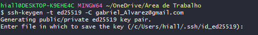
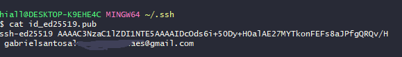
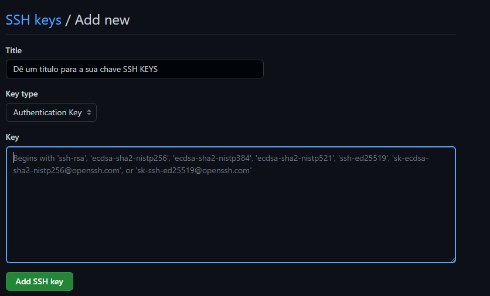

## Anotações referencial a introdução ao Git e Github

### chaves SSH e Token **Git Bash**
#### Vinculando o seu Computador com o Git pela primeira vez
<br>
Abra o Git bash e digite o seguinte código:

```git
ssh-keygen -t ed25519 -C EmailUtilizadoNoGithub@git.com
```
Enter File in Which To save the key(local onde vai ser salvo a chave, caso deseje salvar onde ele está direcionando, é só pressionar enter)
</img>
- abrir a pasta C:/Users/NameYourPC/.ssh
- Execute o Git bash dentro da pasta

para visualizar o conteúdo a chave publica:
```git
cat id_ed25519.pub
```
Resultado:
</img>

No Git bash ele lhe dará o resultado da shave criptografada com o email, iremos copiar e leva-lo para o Git, segue imagem abaixo:
</img>
Crie um titulo para a sua chave e cole no espaço Key, em seguida pressione o botão "Add SSH Key"
</img>
